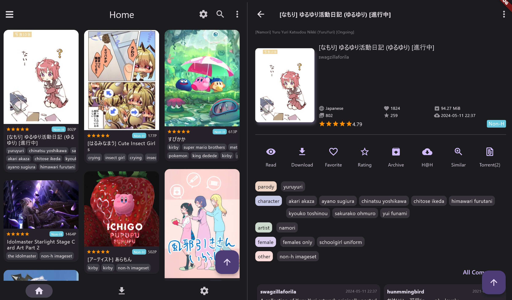
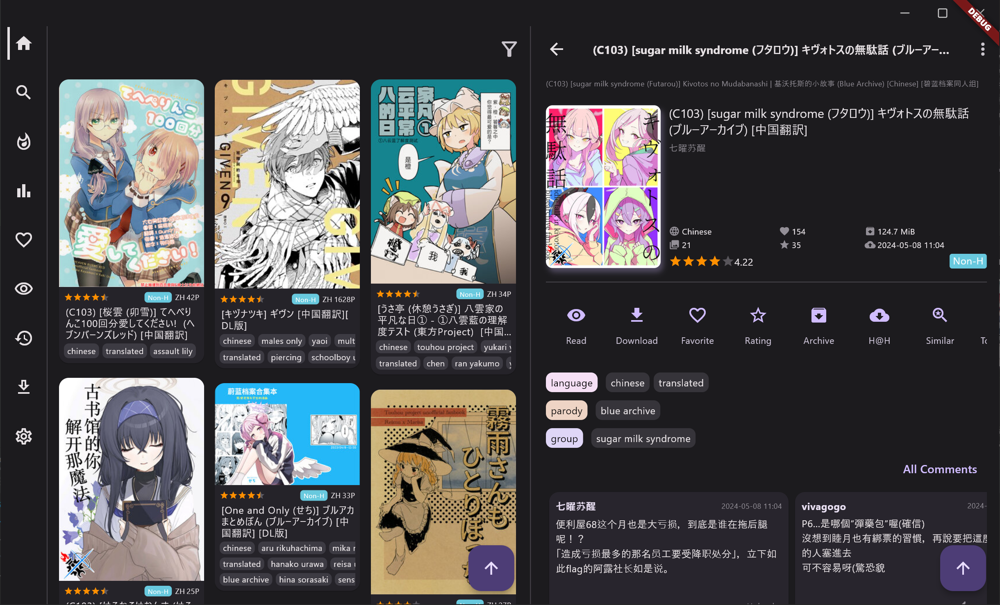
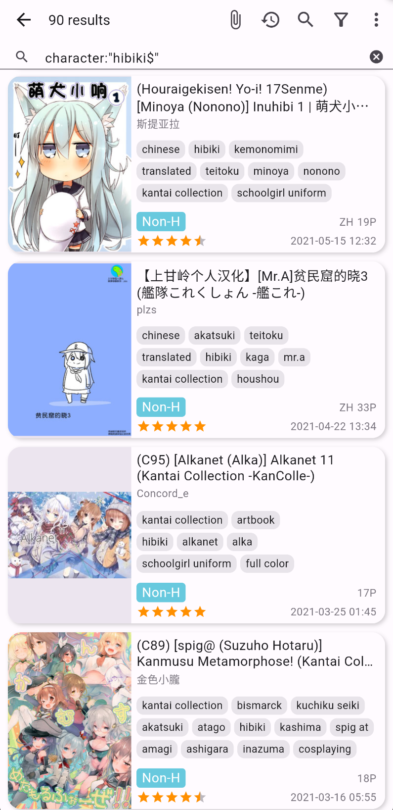
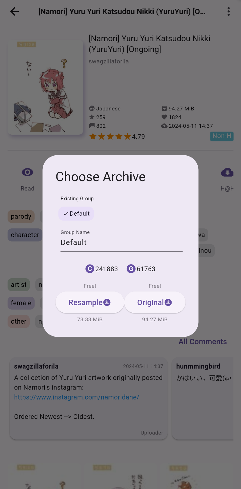
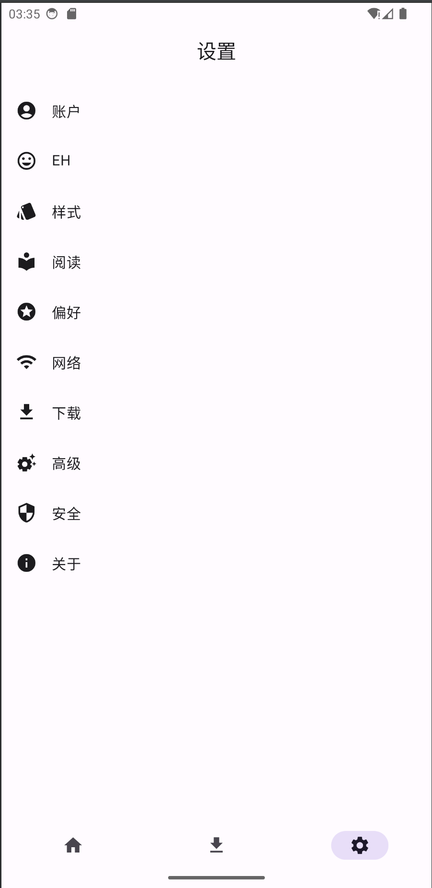
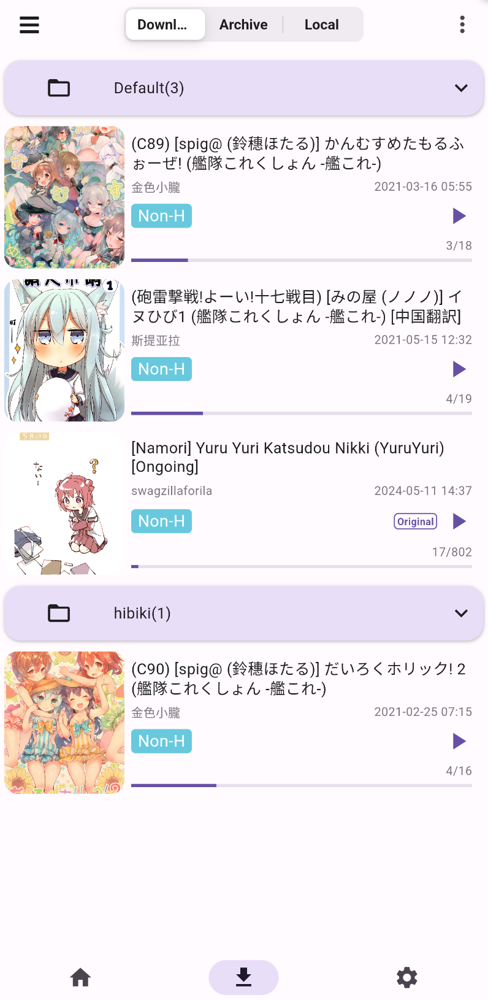
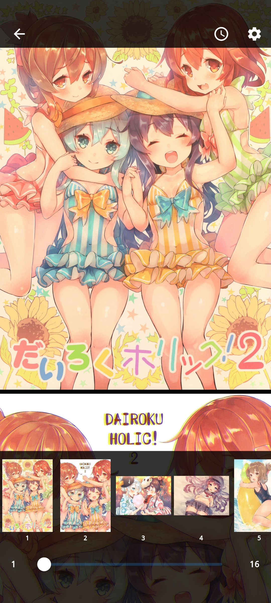

# JHenTai

[English](https://github.com/jiangtian616/JHenTai/blob/master/README.md) | 简体中文
| [한국어](https://github.com/jiangtian616/JHenTai/blob/master/README_kr.md)

[常见问题，提问前必看](https://github.com/jiangtian616/JHenTai/wiki/%E5%B8%B8%E8%A7%81%E9%97%AE%E9%A2%98)

[点击打开 上色功能所需python环境 ](./上色功能所需环境/)

## 定位

E-hentai 的一个多端app，现支持Android、iOS、Windows、MacOS和Linux系统。

仍在发展阶段，十分欢迎提交各种bug反馈或Feature Request。

## 借鉴与感谢

布局样式参考:

- [FEhviewer](https://github.com/honjow/FEhViewer) : 主要
- [EHPanda](https://github.com/tatsuz0u/EhPanda)
- [EHViewer](https://gitlab.com/NekoInverter/EhViewer)

标签翻译数据库:

- [EhTagTranslation](https://github.com/EhTagTranslation/Database)

标签排序:

- [e-hentai-db](https://github.com/ccloli/e-hentai-db)
- [e-hentai-tag-count](https://github.com/mokurin000/e-hentai-tag-count)
- [EhSyringe](https://github.com/EhTagTranslation/EhSyringe)

App翻译：

- [andyching168](https://github.com/andyching168) [kenny03211](https://github.com/kenny03211) [NeKoOuO](https://github.com/NeKoOuO) 繁體中文(台灣)
- [lucas-04](https://github.com/lucas-04) 葡萄牙语 Português brasileiro
- [qlife1146](https://github.com/qlife1146) 韩语
- [bropines](https://github.com/bropines) Russian

十分感谢以上项目与人员🙇‍

## 截图

### 手机模式

### 平板模式

### 桌面模式

### 画廊页 & 搜索页

 

### 画廊详情页

### 设置 & 下载

### 阅读

## 主要功能

- [x] 支持手机、平板、桌面三端布局
- [x] 支持上下、左右、双列等共四种阅读布局
- [x] 主页、热门、收藏、关注、历史，支持多种画廊样式
- [x] 搜索、搜索Tag提示、点击Tag快捷搜索、以图搜图、跳页
- [x] 在线阅读与下载，支持恢复下载记录，支持在上传者更新画廊后同步更新本地已下载的画廊
- [x] 支持下载归档并自动解压、阅读
- [x] 支持读取本地图片，当作本地阅读器
- [x] 下载画廊支持手动调节任务优先级、下载分组、自定义排序
- [x] 画廊和归档支持打上分组标签，统一展开折叠
- [x] 收藏、评分、磁力、归档、统计、分享
- [x] 账号密码登录、Cookie登录、Web登录
- [x] 支持域名前置直连里站
- [x] Tag翻译、Tag投票、关注Tag、隐藏Tag
- [x] 评论、评论投票
- [x] 指纹解锁

## 国际化步骤

> [languageCode](https://github.com/unicode-org/cldr/blob/master/common/validity/language.xml)
>
> [countryCode](https://github.com/unicode-org/cldr/blob/master/common/validity/region.xml)

1. 复制 `/lib/src/l18n/en_US.dart` 一份并重命名为`{your_languageCode}_{your_countryCode}.dart`
2. 更改新文件的class name(可选)
3. 修改keys方法返回的所有键值对，将value翻译为你的语言

你可以只做以上步骤然后提交PR，我会补充其他的步骤，或者你自己可以继续：

4. 在 `/lib/src/l18n/locale_text.dart`
   的keys方法中增加一条键值对`{your_languageCode}_{your_countryCode} : {your_className}.keys()`
5. 在 `/lib/src/consts/locale_consts.dart` 的 `localeCode2Description`
   属性中增加一条键值对`{your_languageCode}_{your_countryCode} : {languageDescription}`，用于描述你的语言

## 项目编译相关

1. 你需要自己管理安卓签名文件，见https://docs.flutter.dev/deployment/android#signing-the-app
2. 使用IDEA或者VSCode直接运行即可

## 主要dart依赖

- [get](https://pub.flutter-io.cn/packages/get): 依赖管理、状态管理、国际化、NoSQL
- [dio](https://pub.flutter-io.cn/packages?q=dio): 网络
- [extendedImage](https://pub.flutter-io.cn/packages/extended_image): 图片
- [drift](https://pub.flutter-io.cn/packages/drift): 数据库
