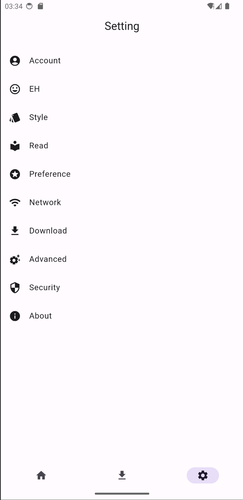

# JHenTai

English | [简体中文](https://github.com/jiangtian616/JHenTai/blob/master/README_cn.md) | [한국어](https://github.com/jiangtian616/JHenTai/blob/master/README_kr.md)

[Q&A](https://github.com/jiangtian616/JHenTai/wiki/Common-Questions)

## 개요

Android & iOS & Windows & MacOS & Linux를 지원하는 E-Hentai 애플리케이션.

아직 개발 중입니다. 오류 제보나 기능 요청은 언제나 환영합니다.

## 참조 & 감사의 말씀

레이아웃과 스타일 참조:

- [FEhviewer](https://github.com/honjow/FEhViewer) : 메인
- [EHPanda](https://github.com/tatsuz0u/EhPanda)
- [EHViewer](https://gitlab.com/NekoInverter/EhViewer)

태그 번역:

- [EhTagTranslation](https://github.com/EhTagTranslation/Database)

Tag order optimization:

- [e-hentai-db](https://github.com/ccloli/e-hentai-db)
- [e-hentai-tag-count](https://github.com/mokurin000/e-hentai-tag-count)
- [EhSyringe](https://github.com/EhTagTranslation/EhSyringe)

앱 번역:

- [andyching168](https://github.com/andyching168) [kenny03211](https://github.com/kenny03211) [NeKoOuO](https://github.com/NeKoOuO) 繁體中文(台灣)
- [lucas-04](https://github.com/lucas-04) Português brasileiro
- [qlife1146](https://github.com/qlife1146) 한국어
- [bropines](https://github.com/bropines) Russian

위의 프로젝트와 인원에게 감사드립니다🙇‍

## 스크린샷

### 모바일 레이아웃

### 태블릿 레이아웃

### 데스크톱 레이아웃

### 갤러리 & 검색

 

### 갤러리 세부 정보

### 설정 & 다운로드

### 보기

## 주 기능

- [x] 모바일, 태블릿, 데스크톱 레이아웃(세 종류)
- [x] 가로, 세로 각각 두 쪽 레이아웃(네 종류)
- [x] 갤러리 페이지, 인기 있음, 즐겨찾기, 본 적 있음, 기록에 서로 다른 갤러리 목록 스타일 지원
- [x] 검색, 검색 추천, 태그를 눌러 검색, 파일 검색, 특정 페이지로 이동
- [x] 온라인 보기 및 다운롣, 다운로드 작업 복원 지원, 업로더가 새로운 버전을 업로드했을 때 업데이트 동기화 지원
- [x] 아카이브 다운로드, 자동 압축 해제 후 보기
- [x] 로컬 이미지 불러오기 및 보기 지원
- [x] 다운로드 작업 우선순위 수동 지정 지원
- [x] 갤러리 및 아카이브에 그룹 설정 지원
- [x] 즐겨찾기, 점수, 토렌트, 아카이브, 통계, 공유
- [x] 암호 로그인, 쿠키 로그인, 웹 로그인
- [x] EX 사이트 지원(도메인 프론팅은 선택사항)
- [x] 태그 추천/비추천, 태그 강조/숨김
- [x] 댓글, 댓글 추천
- [x] 지문 잠금 해제

## 번역

> [언어 코드](https://github.com/unicode-org/cldr/blob/master/common/validity/language.xml)
>
> [지역 코드](https://github.com/unicode-org/cldr/blob/master/common/validity/region.xml)

1. `/lib/src/l18n/en_US.dart`를 복사 후 이름을 `{사용자의_언어_코드}_{사용자의_지역_코드}.dart`로 바꾸세요
2. 새 파일의 클래스명을 바꾸세요(선택 사항)
3. 메서드 `keys`에서 k-v 쌍을 수정하고, 값을 사용자 언어로 번역하세요

여기까지 한 후에 풀 리퀘스트를 제출하시면 나머지 작업은 제가 합니다. 아니면 다음 사항을 계속 진행하셔도 됩니다:

4. `/lib/src/l18n/locale_text.dart`에 들어간 후, 새로운 k-v 쌍을 메서드 `keys`에 추가하세요.
   => `{사용자의_언어_코드}_{사용자의_지역_코드} : {사용자의_클래스명}.keys()`
5. Enter `/lib/src/consts/locale_consts.dart`에 들어간 후, `localeCode2Description` 속성에 새로운 k-v 쌍을
   추가하세요 : `{사용자의_언어_코드}_{사용자의_지역_코드} : {언어 설명}` 형식으로 사용자 언어의 설명을 작성하세요.

## 컴파일 정보

1. Android 서명을 직접 관리하려면 다음 사이트를 확인하세요: https://docs.flutter.dev/deployment/android#signing-the-app

## Dart 주요 종속성

- [get](https://pub.flutter-io.cn/packages/get): 종속성 관리, 상태 관리, l18n, NoSQL
- [dio](https://pub.flutter-io.cn/packages?q=dio): 네트워크
- [extendedImage](https://pub.flutter-io.cn/packages/extended_image): 이미지
- [drift](https://pub.flutter-io.cn/packages/drift): 데이터베이스
